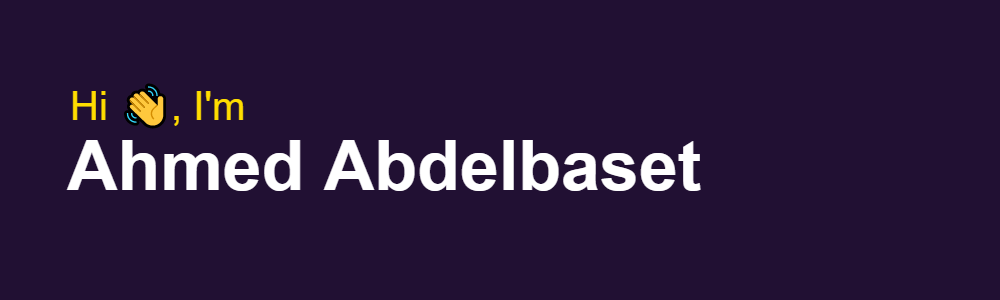

```typescript
// Personality 
const name = "Ahmed Abdelbaset";
let age = 20;
const country = "Egypt";
const languagesSpoken = {
  English: "Fluent",
  Arabic: "Native"
}

const skills: Skill[] = [
    "HTML", "CSS", "SCSS", "TailwindCSS", 
    "JavaScript", "TypeScript", 
    "React.js", "Next.js",
    "Node.js", "Express.js",
    "MongoDB", "Firebase",
    ...
  ];

let isGraduated: boolean = 0.1 + 0.2 === 0.3;

const YEAR_IN_MS = 1000 * 60 * 60 * 24 * 365.25

setInterval(() => {
  age++;
  
  if (new Date().getFullYear() >= 2024) {
    isGraduated = 
      (0.1 * 10) + (0.2 * 10) === (0.3 * 10)
  }
}, YEAR_IN_MS)

```


<!--
[](https://github.com/A7med3bdulBaset)


### Hey there, I'm 
<hr>

-->


<!--


<p align="left"></p>


<h3 align="left">Languages and Tools:</h3>
<p align="left"> 
  <a href="https://www.w3.org/html/" target="_blank" rel="noreferrer"> 
    &nbsp;&nbsp; 
  </a> 
  <a href="https://www.w3schools.com/css/" target="_blank" rel="noreferrer"> 
    &nbsp;&nbsp; 
  </a> 
  <a href="https://developer.mozilla.org/en-US/docs/Web/JavaScript" target="_blank" rel="noreferrer"> 
    &nbsp;&nbsp; 
  </a> 
  <a href="https://www.typescriptlang.org/" target="_blank" rel="noreferrer"> 
    &nbsp;&nbsp; 
  </a> 
  <a href="https://reactjs.org/" target="_blank" rel="noreferrer"> 
    &nbsp;&nbsp;
  </a> 
  
  <a href="https://sass-lang.com" target="_blank" rel="noreferrer"> 
    &nbsp;&nbsp; 
  </a> 
  
  <br />
  
  <a href="https://tailwindcss.com/" target="_blank" rel="noreferrer"> 
    &nbsp;&nbsp; 
  </a> 
  <a href="https://getbootstrap.com" target="_blank" rel="noreferrer"> 
    &nbsp;&nbsp; 
  </a> 
  
  <a href="https://nodejs.org" target="_blank" rel="noreferrer"> 
    &nbsp;&nbsp; 
  </a> 
  <a href="https://reactnative.dev/" target="_blank" rel="noreferrer"> 
    &nbsp;&nbsp; 
  </a> 
  
  <a href="https://git-scm.com/" target="_blank" rel="noreferrer"> 
    &nbsp;&nbsp; 
  </a> 
  <a href="https://firebase.google.com/" target="_blank" rel="noreferrer"> 
    &nbsp;&nbsp; 
  </a>
</p>
-->
<!-- ## Skils:  
  
  
  
  
  
  
  
  
  
  
  
  
  
  
  
  

## Tools:
  
  
  
  
  


[](https://github.com/A7med3bdulBaset)
[](https://github.com/A7med3bdulBaset)

-->


 

<h3 align="left">Connect with me:</h3>
<p align="left">
<a href="https://codepen.io/a7med3bdulbaset" target="blank"></a>
<a href="https://twitter.com/a7med3bdulbaset" target="blank"></a>
<a href="https://linkedin.com/in/a7med3bdulbaset" target="blank"></a>
<a href="https://stackoverflow.com/users/a7med3bdulbaset" target="blank"></a>
<a href="https://fb.com/a7med3bdulbaset" target="blank"></a>
<a href="https://instagram.com/a7med3bdulbaset" target="blank"></a>
<a href="https://medium.com/@a7med3bdulbaset" target="blank"></a>
<a href="https://www.youtube.com/c/a7med3bdulbaset" target="blank"></a>
</p>

<hr />

<!--
**A7med3bdulBaset/A7med3bdulBaset** is a ✨ _special_ ✨ repository because its `README.md` (this file) appears on your GitHub profile.

Here are some ideas to get you started:

- 🔭 I’m currently working on ...
- 🌱 I’m currently learning ...
- 👯 I’m looking to collaborate on ...
- 🤔 I’m looking for help with ...
- 💬 Ask me about ...
- 📫 How to reach me: ...
- 😄 Pronouns: ...
- ⚡ Fun fact: ...
-->
